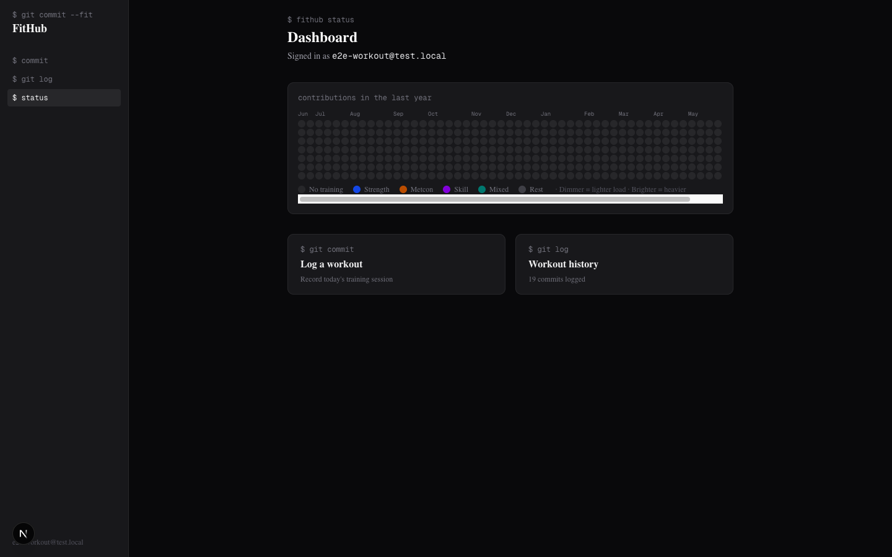
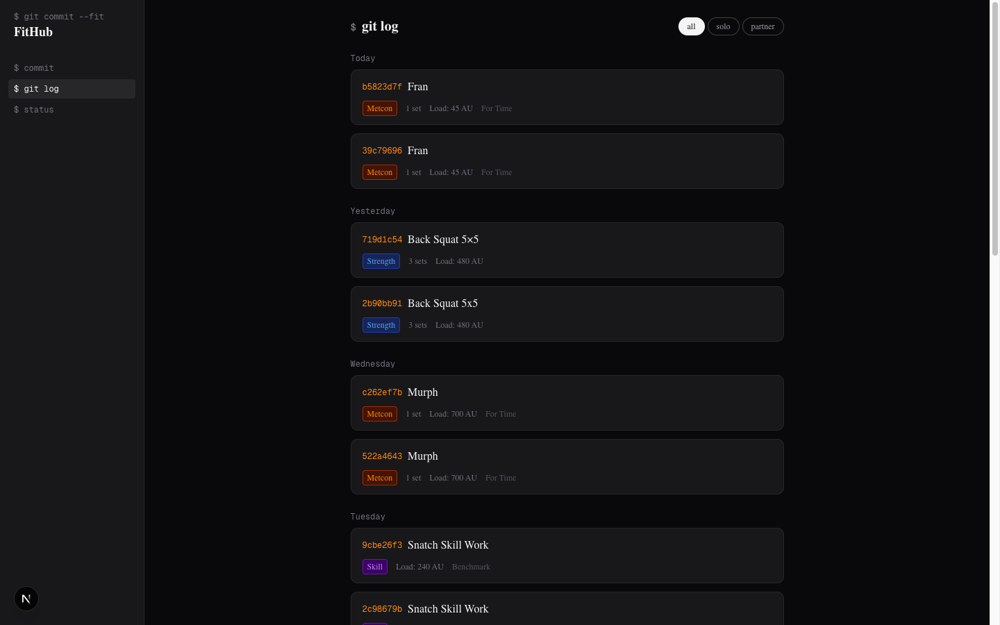
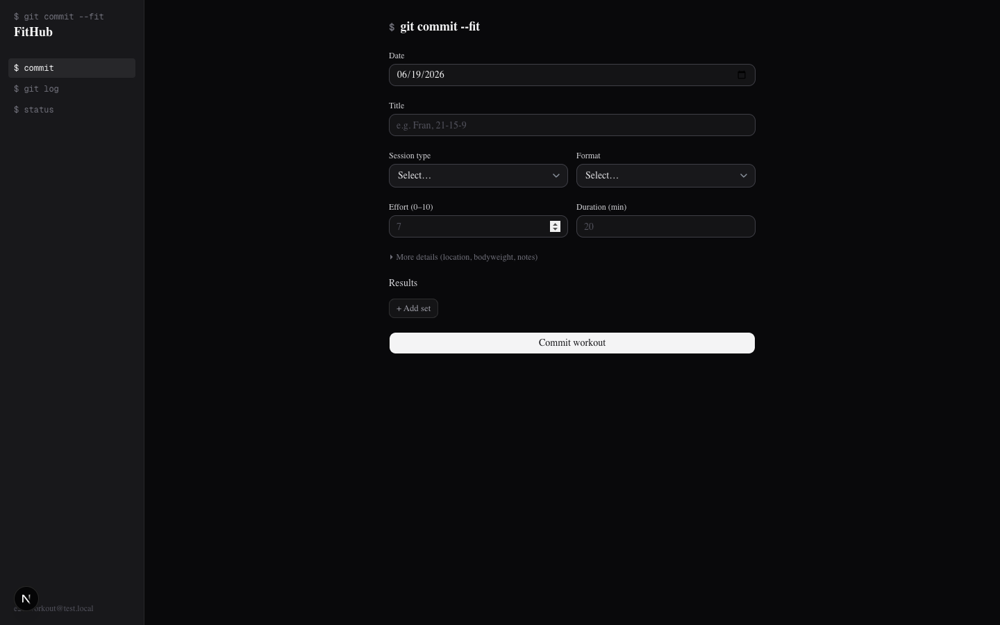
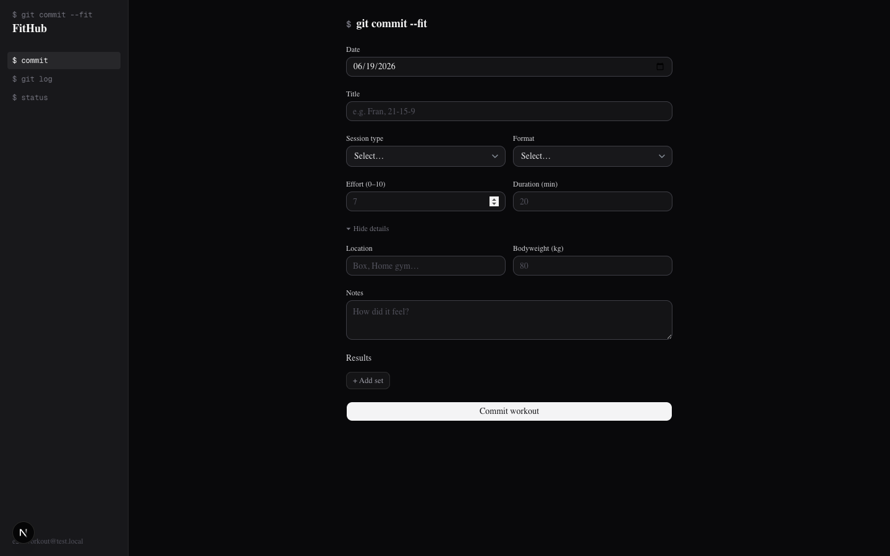
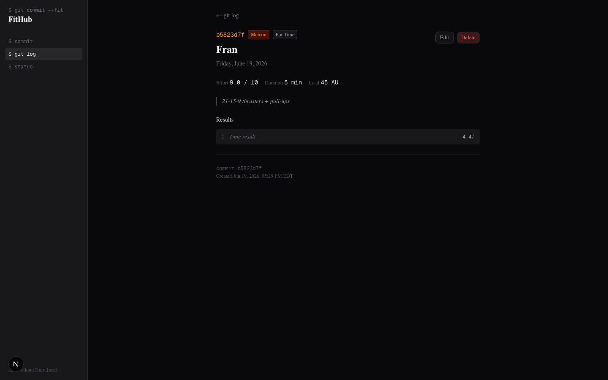

# FitHub

**git for your physical fitness**

[](https://github.com/rbisecke/FitHub/actions/workflows/ci.yml)
[](LICENSE)
[](https://www.python.org/downloads/)
[](https://www.typescriptlang.org/)
[](https://github.com/astral-sh/ruff)



FitHub is a training tracker built on a git mental model: every workout is a commit with a short hash ID, the home screen is a contribution graph, and a sidebar styled like a terminal prompt anchors the theme. Under the surface it applies the sports-science models that most fitness apps skip — sRPE-based load, ACWR, and Hooper readiness — plus a deterministic AI layer that generates plans and coaching prose without ever being the source of safety decisions.

The app is invite-only and in active development. Email [rbisecke@gmail.com](mailto:rbisecke@gmail.com) to request access, or [run it locally](#getting-started).

---

## What it does

| Theme                   | Details                                                                                                                                                             |
| ----------------------- | ------------------------------------------------------------------------------------------------------------------------------------------------------------------- |
| **Training log**        | Commit metaphor for workouts — short hash IDs, contribution graph, support for strength, AMRAP, EMOM, benchmark WODs, and team sessions                             |
| **Load management**     | sRPE × duration perceived load; ACWR (Acute:Chronic Workload Ratio) via EWMA; ATL/CTL/TSB; Hooper index check-ins for daily readiness                               |
| **AI coach & planning** | Natural-language log parser; hybrid RAG coach (BM25 + pgvector RRF fusion); adaptive plan generator with deterministic ACWR/readiness triggers; injury train-around |
| **Data model depth**    | Poliquin 4-digit tempo notation; Epley e1RM cached at write time; VBT fields; wearable-ready schema; IDOR-safe team session consent model                           |
| **Engineering**         | Invite-only multi-user from day one; deterministic safety logic; 397 tests across three suites; openapi-typescript contract check in CI                             |

---

## Architecture

```
FitHub/
├── apps/
│   ├── api/          # FastAPI — Python 3.14, Alembic migrations, psycopg3
│   └── web/          # Next.js 16 App Router, shadcn/ui (Base UI), Tailwind v4
├── packages/
│   └── shared/       # TypeScript types generated from the FastAPI OpenAPI spec
├── supabase/         # Local dev config, seed data, pgTAP RLS tests
└── .github/          # CI: api, web, contract drift, security audit
```

**Data flow:**

```
Browser → Next.js → FastAPI (ES256 JWT via JWKS) → Supabase Postgres
```

The frontend calls FastAPI exclusively. Supabase handles auth (magic-link + Google OAuth); FastAPI verifies the JWT against the Supabase JWKS endpoint. The frontend never touches the database directly. RLS is enforced on every table as a second layer independent of the application.

`packages/shared` contains TypeScript types generated from the FastAPI OpenAPI schema via `openapi-typescript`. A CI job re-exports the spec and regenerates types on every PR, failing on any drift between the API contract and the frontend type definitions.

| Layer    | Technology                                                            |
| -------- | --------------------------------------------------------------------- |
| Frontend | Next.js 16 App Router, shadcn/ui (Base UI), Tailwind v4               |
| Backend  | FastAPI, Pydantic v2, Alembic, psycopg3                               |
| Database | Supabase Postgres + pgvector, RLS on every table                      |
| Auth     | Supabase magic-link + Google OAuth, ES256 JWT via JWKS                |
| AI       | Claude Haiku 4.5 via Instructor, hybrid RAG (BM25 + pgvector RRF)     |
| Testing  | pytest (301), pgTAP RLS (42), Playwright E2E (54)                     |
| CI       | GitHub Actions: lint, typecheck, test, contract drift, security audit |
| Hosting  | Railway (API) · Vercel (web) · Supabase (DB / auth)                   |

---

## AI architecture

The core principle: **safety-critical logic is deterministic Python; the LLM generates prose and plans only.** The AI never decides whether a load level is safe or whether to adapt a program — deterministic rules make those decisions, and the LLM explains the result.

### Components

**NL log parser** — parses free-text workout descriptions into structured Pydantic models using [Instructor](https://github.com/instructor-ai/instructor) with Anthropic tool-use constrained decoding. Schema adherence is ~99% with Instructor vs ~85% with raw JSON mode; the structured output is validated by Pydantic before write.

**Hybrid RAG coach** — retrieval combines BM25 keyword search and pgvector cosine similarity with Reciprocal Rank Fusion. Sources include CrossFit Level 1 programming standards, coaching notes, and session history. Context is XML-delimited before injection to mitigate prompt injection. `GET /api/v1/coach/history` returns persistent session history.

**Adaptive plan generator** — returns HTTP 202 immediately and exposes a polling URL (async task pattern). Inputs are structured: Epley 1RM estimates, current ACWR, and Hooper readiness score. Output is validated against the sports-science knowledge base before persisting.

**Adaptation engine** — deterministic triggers fire when ACWR >1.5, readiness <0.4, consecutive missed sessions, or RPE drift exceeds threshold. When a trigger fires, it is passed to the LLM with full context to generate a rationale. The LLM does not decide _whether_ to adapt.

**Safety classifier** — evaluated on a 60-case golden set with 100% STOP accuracy on dangerous requests. Injury red-flag detection is rule-based Python, not LLM.

### Model strategy

| Environment | Model                                                             | Cost                    |
| ----------- | ----------------------------------------------------------------- | ----------------------- |
| Dev / CI    | `STUB_LLM=true` (deterministic fixture responses, zero API calls) | $0                      |
| Production  | Claude Haiku 4.5                                                  | $1 / $5 per MTok in/out |

---

## Screenshots

<table>
<tr>
  <td align="center" width="50%">
    
    <br /><sub>History — date-grouped sessions, session-type colour coding, PR badges</sub>
  </td>
  <td align="center" width="50%">
    
    <br /><sub>Log form — AI natural-language parse or manual entry</sub>
  </td>
</tr>
<tr>
  <td align="center" width="50%">
    
    <br /><sub>Log form expanded — full movement breakdown with set data</sub>
  </td>
  <td align="center" width="50%">
    
    <br /><sub>Workout detail — git-commit view with result table and hash footer</sub>
  </td>
</tr>
</table>

---

## Getting started

### Prerequisites

- **Node.js ≥ 20** and **pnpm ≥ 9** — `npm install -g pnpm`
- **Python 3.14** and **uv** — `curl -LsSf https://astral.sh/uv/install.sh | sh`
- **Docker** — required for local Supabase
- **Supabase CLI** — `brew install supabase/tap/supabase` or [see the docs](https://supabase.com/docs/guides/cli/getting-started)

### Setup

Start local Supabase first — everything else depends on it:

```bash
supabase start
```

Then clone, install, and configure:

```bash
git clone https://github.com/rbisecke/FitHub.git
cd FitHub

pnpm install
uv sync --project apps/api

cp .env.example .env
# Fill in values from `supabase status`:
#   API URL → NEXT_PUBLIC_SUPABASE_URL
#   anon key → NEXT_PUBLIC_SUPABASE_ANON_KEY
#   service_role key → SUPABASE_SERVICE_ROLE_KEY
#   DB URL → DATABASE_URL  (use 127.0.0.1, not localhost — see gotchas)
```

Apply migrations and start the apps:

```bash
# Apply database migrations
uv run --project apps/api alembic -c apps/api/alembic.ini upgrade head

# Terminal 1 — API (LLM stubbed; no API key required)
STUB_LLM=true uv run --project apps/api uvicorn app.main:app --app-dir apps/api --port 8000

# Terminal 2 — Web
pnpm --filter web dev
```

Open [http://localhost:3000](http://localhost:3000). The app is invite-only; add your email to the `invited_emails` table via the local Supabase Studio at [http://localhost:54323](http://localhost:54323) to log in.

### Known gotchas

**Use `127.0.0.1`, not `localhost`** — on macOS, `localhost` resolves to `::1` (IPv6) and the psycopg3 connection will fail. The `DATABASE_URL` in `.env` must use `127.0.0.1:54322`.

**pytest requires an absolute test path** — `uv run --project apps/api pytest apps/api/tests` may fail depending on your working directory. Use `$(pwd)/apps/api/tests/` to be safe.

**`STUB_LLM=true` is mandatory for the test suite** — with it set, all LLM calls return deterministic fixture responses and no API key is required. Without it the AI tests will attempt real API calls and fail or accumulate cost.

---

## Testing

FitHub has three test suites and passes strict static analysis. pgTAP is worth highlighting — most web applications rely solely on application-layer authorization checks; the 42 pgTAP tests verify that RLS policies prevent cross-user data access at the database layer, independent of the application code.

| Suite              | Tool        | Count | Covers                                                  |
| ------------------ | ----------- | ----- | ------------------------------------------------------- |
| Unit + integration | pytest      | 301   | API routes, repositories, AI stubs, rate limiting, auth |
| DB isolation       | pgTAP       | 42    | RLS policies on every table, cross-user data isolation  |
| Browser E2E        | Playwright  | 54    | Auth flow, workout CRUD, coach chat, plan generation    |
| Static analysis    | mypy + ruff | —     | Strict mypy, zero `Any` in models, ruff format          |

```bash
# Unit + integration
STUB_LLM=true uv run --project apps/api pytest $(pwd)/apps/api/tests/ -v

# RLS isolation (requires local Supabase running)
supabase --workdir . test db

# E2E (requires API running on port 8000 with STUB_LLM=true)
pnpm --filter web exec playwright test
```

---

## CI

GitHub Actions runs on every push to `main` and on every PR. Five jobs, all with SHA-pinned actions:

- **Web** — typecheck, ESLint, Vitest; path-filtered to `apps/web/**`
- **API** — ruff lint/format, mypy, pytest against a real local Supabase instance; path-filtered to `apps/api/**`
- **Contract** — re-exports the FastAPI OpenAPI spec and regenerates TypeScript types; fails if either file drifts from what is committed
- **Security** — pip-audit, npm audit (`--audit-level=high`), and a git-history secret scan; runs unconditionally on every push
- **Commit lint** — validates conventional commit format on PRs (informational; not a required merge check)

Dependabot keeps Actions SHAs current monthly and pip/npm dependencies weekly.

---

## Status & roadmap

Phases 0–7b are merged. Deployment (Phase 7c — Railway + Vercel + Supabase production) is the current milestone.

Near-term:

- **Wearable data sync** — schema is wearable-ready; Oura / Apple Health pipeline not yet wired
- **Nutrition tracking** — designed in `claude_docs/planning/`; deferred post-deployment
- **Mobile PWA** — manifest and offline strategy planned; not yet implemented

**Access:** Email [rbisecke@gmail.com](mailto:rbisecke@gmail.com) to request an invite, or clone and [run locally](#getting-started).

---

## Contributing

Bug reports and PRs welcome. For significant feature changes, open an issue first.

Engineering standards that are not negotiable are in [`CONSTITUTION.md`](CONSTITUTION.md). Security vulnerabilities should be reported privately via the GitHub [Security tab](https://github.com/rbisecke/FitHub/security/advisories/new) — see [`.github/SECURITY.md`](.github/SECURITY.md) for scope and process.

MIT License — see [LICENSE](LICENSE).
